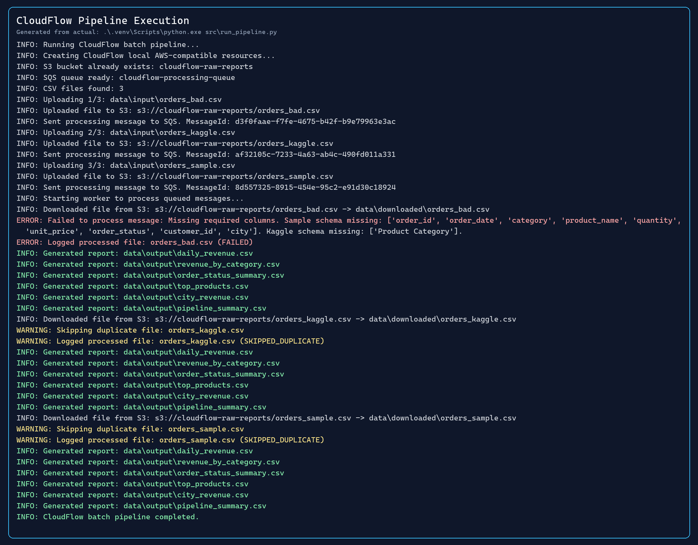
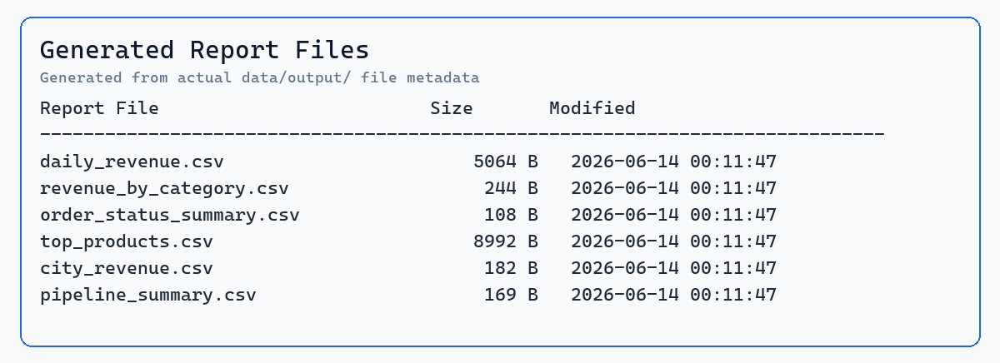
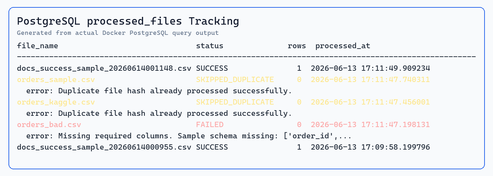

# CloudFlow: Python Automation Pipeline


CloudFlow is a production-like local Python automation pipeline for recurring CSV business reports. It uses Floci to emulate AWS-compatible S3/SQS locally, processes files with Pandas, stores cleaned data and processing logs in PostgreSQL, and generates PowerBI-ready CSV reports.

The project is intentionally scoped to Python automation, SQL, local AWS-compatible services, PostgreSQL, testing, and code quality tooling.

## Key Features

- Batch ingestion for CSV files in `data/input/`
- Kaggle online sales CSV schema support
- Original sample order schema support
- Floci S3-compatible bucket upload using `boto3`
- Floci SQS-compatible message queue using `boto3`
- Worker-based file processing
- SHA256 duplicate detection
- Failed file tracking without crashing the worker
- PostgreSQL tables for cleaned data and processing logs
- SQL-generated PowerBI-ready CSV outputs
- Console and file logging to `logs/cloudflow.log`
- CLI arguments, PowerShell helper scripts, pytest tests, Ruff, Black, and GitHub Actions CI

## Tech Stack

Python 3.11, SQL, Pandas, boto3, Floci, Docker, PostgreSQL, pytest, Ruff, Black, GitHub Actions, PowerBI-ready CSV outputs.

## Architecture

```text
Kaggle CSV Reports
   ↓
Python Batch Runner
   ↓
Floci S3-compatible Bucket
   ↓
Floci SQS-compatible Queue
   ↓
Python Worker
   ↓
SHA256 Duplicate Check
   ↓
Pandas Validation and Cleaning
   ↓
PostgreSQL
orders_cleaned + processed_files
   ↓
SQL KPI Reports
   ↓
PowerBI-ready CSV Outputs
```

## Dataset

The main dataset is a Kaggle-style online sales CSV:

```text
data/input/orders_kaggle.csv
```

The processor also supports the original sample schema:

```text
data/input/orders_sample.csv
```

The intentionally invalid file below demonstrates failed file tracking:

```text
data/input/orders_bad.csv
```

## Project Structure

```text
CloudFlow-Python-Automation-Pipeline/
├─ data/input/                 # Source CSV files committed to the repo
├─ data/output/                # Generated report CSV files, ignored by Git
├─ data/downloaded/            # Worker downloads from Floci S3, ignored by Git
├─ docs/images/                # README screenshot placeholders
├─ logs/                       # Runtime logs, ignored by Git
├─ scripts/                    # Windows PowerShell helper scripts
├─ src/                        # Pipeline modules
├─ tests/                      # Unit tests
├─ .github/workflows/ci.yml    # GitHub Actions CI
├─ docker-compose.yml          # Floci and PostgreSQL services
├─ pyproject.toml              # Ruff and Black configuration
└─ requirements.txt
```

## Setup

```powershell
python -m venv .venv
.\.venv\Scripts\Activate.ps1
pip install -r requirements.txt
docker compose up -d
```

## How to Run

Helper scripts:

```powershell
.\scripts\run_pipeline.ps1
.\scripts\verify.ps1
```

Manual usage:

```powershell
python -m venv .venv
.\.venv\Scripts\Activate.ps1
pip install -r requirements.txt
docker compose up -d
python src\run_pipeline.py
pytest
```

## CLI Usage

```powershell
python src\run_pipeline.py
python src\run_pipeline.py --input-dir data\input
python src\run_pipeline.py --file data\input\orders_kaggle.csv
python src\run_pipeline.py --max-worker-runs 5
```

Available options:

- `--input-dir`: directory containing CSV files, default `data/input`
- `--output-dir`: report output directory, default `data/output`
- `--file`: process one specific CSV file
- `--max-worker-runs`: maximum number of SQS messages the worker should process

## Generated Reports

Reports are generated in `data/output/`. This folder is ignored by Git because it contains runtime outputs.

- `daily_revenue.csv`
- `revenue_by_category.csv`
- `order_status_summary.csv`
- `top_products.csv`
- `city_revenue.csv`
- `pipeline_summary.csv`

For PowerBI web users who can only import one CSV file, create a consolidated long-format dataset:

```powershell
python scripts\create_powerbi_single_csv.py
```

This generates:

```text
data/output/powerbi_dashboard_dataset.csv
```

Import `data/output/powerbi_dashboard_dataset.csv` into PowerBI web for dashboard proof.

## Logging

CloudFlow writes readable logs to the console and detailed logs to:

```text
logs/cloudflow.log
```

Log levels:

- `INFO`: normal pipeline events
- `WARNING`: duplicate or skipped files
- `ERROR`: failed file processing

## PostgreSQL Tracking

Open a PostgreSQL shell:

```powershell
docker exec -it cloudflow-postgres psql -U cloudflow -d cloudflow_db
```

Inspect processed files:

```sql
SELECT file_name, status, row_count, error_message, processed_at
FROM processed_files
ORDER BY processed_at DESC;
```

## Duplicate and Failed File Handling

Run the pipeline twice:

```powershell
python src\run_pipeline.py
python src\run_pipeline.py
```

The second run should log duplicate files as `SKIPPED_DUPLICATE` because the same SHA256 file hashes have already been processed.

Check failed file tracking:

```sql
SELECT file_name, status, error_message
FROM processed_files
WHERE status = 'FAILED';
```

`orders_bad.csv` is intentionally invalid and should be tracked as `FAILED`.

## Tests and Code Quality

```powershell
python -m py_compile src\processor.py src\report.py src\run_pipeline.py src\worker.py src\upload_file.py src\create_resources.py src\database.py src\utils.py src\logger.py
python -m pytest
python -m ruff check src tests
python -m black --check src tests
```

GitHub Actions runs the same unit-test and static-check workflow on `push` and `pull_request`. CI does not require Docker, Floci, or PostgreSQL.

## Demo Screenshots

> Screenshots can be added after running the pipeline locally.

### Pipeline Execution



### Generated Reports



### PostgreSQL Processing Tracking



## Screenshot Capture Instructions

Capture these screenshots manually after running the project:

- Terminal output after running:

```powershell
.\scripts\run_pipeline.ps1
```

- The `data/output/` folder showing generated CSV reports
- PostgreSQL `processed_files` query showing `SUCCESS`, `FAILED`, and `SKIPPED_DUPLICATE`
- GitHub Actions CI green check if you want to add a verified CI screenshot later

Suggested image file paths:

- `docs/images/pipeline-execution.png`
- `docs/images/generated-reports.png`
- `docs/images/postgresql-tracking.png`

## Future Improvements

- Add more input data validation rules
- Add report-level unit tests for SQL output shape
- Add sample screenshots after a local run
- Add optional documentation for importing generated CSV files into PowerBI

